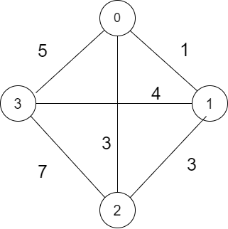

# Explanation of the solution for the travelling salesman problem.

### Problem Statement
    
    To solve the travelling salesman problem with A* algorithm being used as the searching algorithm.
    
### Solution Explanation   

Since the search algorithm to be used should be A* algorithm,  so we need a heuristic function which is a component of the A* algorithm. 

The **heuristic function** used is defined as:

 To find the heursitic cost for a certain node A1, we do it by exploring all the unexplored nodes, by travelling from one node to other by the least cost path available. By exploring, it means to explore all the remaining unexplored nodes only once and finally reaching the start state when all nodes are explored. 
 By exploring in such way, we calculate the cost of the path taken to reach the start node, and the calculated cost becomes the heuristic cost of the node of which we are trying to calculate. 
 

In the above image, let 0 node be the start node. So to calculate the heuristic of the above diagram, we do it by travelling all the unexplored node only once and returning back to start node. We leave the current node by choosing the lowest cost edge available which leads to a unexplored edge. 

To understand the process, let's calculate the heursistic for node 0.

The  edge connected with least edge weight is edge connecting node 0 and node 1 with egde weight 1. So, we choose this edge and travel to node 1 from node 0. So, now we have explored node 0 and **node 1**. Again, from node 1, path available are path of cost 1,4 and 3. We can't choose path with path cost 1 as this will lead to node 0 which is already explored.Also, node 0 is the start state, which should be reached again after only exploring every other node only once. So, now we are left with node of cost 4 and 3. So, 3 being the lower cost between the two,we choose path of cost 3 and move to **node 2**. Now similarly from node 2, we have the path choice of only path with path cost 7. So ,we choose this path and move to node 3. At this point, we have explored every node available in the **TSP**. So, now we move to starting node from node 3, which is node 0. This is done by moving through the path of path cost 5. 

Therefore,total cost achieved is 1+3+7+5=16. 

Thus 16 will be the heursitic cost for node 0. 

Here, the heuristic cost calculated will be overestimating. This is because, the path cost calculated to reach goal state is calculated in a greedy way, which may give at best optimal solution or a sub-optimal solution, in every case. 

## Steps to follow while running the program

 **1**> You can execute the program by executing the executing file or by compiling the .cpp file by running make command. Make sure makefile is present in the current directory where the cpp file (source code) is. 
 
**2**> On executing the program, first thing the program asks is for the number of nodes we want for the **TSP** problem.

**3**> Next, the program needs the user to insert the edge weights. In this program, the assumption is made that the start node is always marked as 0 and all other nodes are marked with distinct numbers from 1 to N-1, if N is the total number of nodes. Then we insert edge weights for each pair of nodes possible, starting with node 0 and pairing starts with node 0 and goes to node N-1. For the pair of self nodes, ie for eg- node 0 and node0, we insert -1 in that case.

For the above graph example, 

The edge weight input will be in the following format-

 -1  1  3  5        
 
  1  -1  3  4 
  
  3  3 -1  7 
  
  5  4  7  -1

After this, output will be displayed in the format-

0 ..... 0 along with the cost for the current ouput tour. 

For in the above example, ouput will be

0 2 1 3 0 and cost displayed will be **15**.

 

    
    
